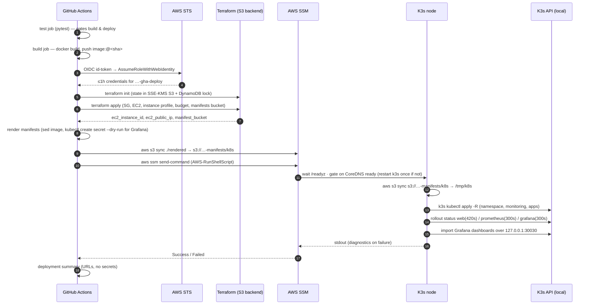
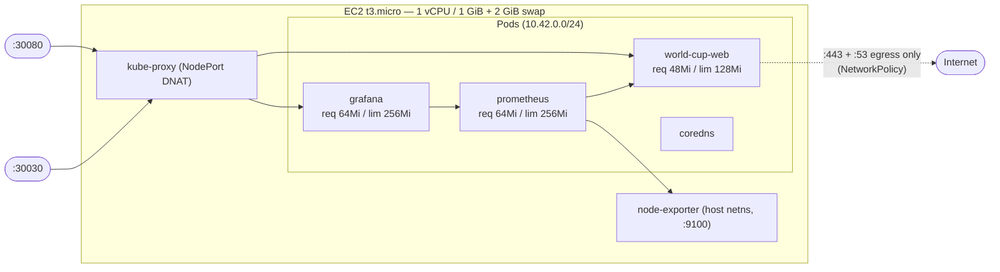

# Architecture

A single-node observability stack for the 2026 FIFA World Cup, built to be
**defensible on the AWS Free Tier at ~$0/month**. See [SECURITY.md](SECURITY.md)
for the control catalogue and threat model.

- [System diagram](#system-diagram)
- [Deploy sequence](#deploy-sequence)
- [Components](#components)
- [Data flow](#data-flow)
- [Runtime topology](#runtime-topology)
- [Key design decisions](#key-design-decisions)

---

## System diagram

```mermaid
flowchart TB
    admin["👤 Admin<br/>(runs infra/bootstrap once)"]
    dev["👤 Viewer / Internet"]
    off["🌐 raw.githubusercontent.com<br/>openfootball/worldcup.json<br/>(public, read-only)"]

    subgraph GH["GitHub"]
        repo["Repo: main branch"]
        gha["Actions: deploy.yml / destroy.yml / ci.yml"]
        ghenv["Environment 'production'<br/>secret: GRAFANA_ADMIN_PASSWORD"]
        repo --> gha
        ghenv -.-> gha
    end

    subgraph AWS["AWS account (single region)"]
        oidc["IAM OIDC provider<br/>token.actions.githubusercontent.com"]
        role["IAM role: …-gha-deploy<br/>(resource-scoped, ≤1h sessions)"]

        subgraph BOOT["infra/bootstrap (admin-applied, account-level)"]
            tfstate["S3: tfstate<br/>SSE-KMS · versioned · TLS-only · BPA"]
            lock["DynamoDB: tf-locks<br/>PAY_PER_REQUEST"]
            cmk["KMS CMK<br/>(state + secrets)"]
            baseline["EBS default encryption<br/>S3 account BPA<br/>Access Analyzer<br/>IAM password policy"]
        end

        subgraph REGION["infra/ (CI-applied)"]
            budget["AWS Budgets<br/>alarm @ $1"]
            manifests["S3: manifests<br/>private · 1-day TTL · SSE-KMS"]
            iprofile["Instance profile<br/>SSM core + s3:Get on manifests/*"]

            subgraph SG["Security group — inbound: 30080, 30030 only"]
                subgraph EC2["EC2 t3.micro · Ubuntu 22.04 · IMDSv2 · encrypted EBS"]
                    subgraph K3S["K3s (API on 6443 — no SG ingress)"]
                        subgraph NSAPP["ns: world-cup-monitoring — PSA enforce=baseline"]
                            web["world-cup-web<br/>frontend + /api/tournament + /metrics<br/>NodePort 30080"]
                            prom["Prometheus<br/>ClusterIP · 2h retention"]
                            graf["Grafana<br/>NodePort 30030 · login required"]
                        end
                        subgraph NSSYS["ns: kube-system"]
                            ne["node-exporter (DaemonSet, hostNetwork)"]
                            dns["CoreDNS"]
                        end
                    end
                end
            end
        end
    end

    admin ==> BOOT
    admin ==> baseline
    gha -- "OIDC id-token" --> oidc
    oidc --> role
    role -- "assume ≤1h" --> gha
    gha -- "terraform apply/destroy" --> REGION
    gha -- "stage rendered manifests" --> manifests
    gha -- "aws ssm send-command" --> EC2
    EC2 -- "k3s kubectl apply (local)" --> K3S
    iprofile -. attached .- EC2
    EC2 -- "s3:Get (SSM pull)" --> manifests

    dev -- "http :30080" --> web
    dev -- "http :30030 (login)" --> graf
    web -- "https :443 (egress: DNS + 443 only)" --> off
    prom -- scrape --> web
    prom -- scrape --> ne
    graf -- query --> prom
    budget -. emails .-> admin
```

Legend: `==>` one-time admin action · `-->` automated (CI / runtime) · `-.-` attachment/notification.

---

## Deploy sequence

The Kubernetes API is **never** reached from the GitHub runner — all `kubectl`
runs on the node itself, driven by SSM. `6443` has no security-group ingress rule.

---

## Components

| Component | Tech | Namespace | Exposure | Notes |
|---|---|---|---|---|
| **world-cup-web** | FastAPI + static frontend, one image | `world-cup-monitoring` | NodePort **30080** (public) | Serves the recap UI, `/api/tournament` (JSON), `/metrics` (Prometheus). Background loop fetches the dataset every 6 h with a 5 m retry. |
| **Prometheus** | `prom/prometheus` (LTS pin) | `world-cup-monitoring` | ClusterIP only | 2 h / 500 MB retention, `emptyDir`. No `--web.enable-lifecycle`. |
| **Grafana** | `grafana/grafana` (10.4 LTS pin) | `world-cup-monitoring` | NodePort **30030** (public, login) | Prometheus datasource + recap dashboard auto-provisioned. Admin password from a GH environment secret. All outbound calls disabled. |
| **node-exporter** | `prom/node-exporter` (pin) | `kube-system` | ClusterIP (`:9100`) | DaemonSet, `hostNetwork`/`hostPID` — isolated from the app namespace so PSA can be strict there. |
| **CoreDNS / local-path / flannel** | K3s built-ins | `kube-system` | — | K3s ships these; Traefik / servicelb / metrics-server are disabled. |
| **Infra** | Terraform ≥ 1.9 | — | — | `infra/bootstrap` (admin, account-level) + `infra/` (CI, per-deploy). |
| **CI/CD** | GitHub Actions | — | — | `deploy.yml`, `destroy.yml`, `ci.yml`; OIDC, SHA-pinned actions, protected environment. |

---

## Data flow

1. `world-cup-web`'s background task GETs
   `https://raw.githubusercontent.com/openfootball/worldcup.json/master/2026/worldcup.json`
   (public, no key), computes the recap (`_compute_recap`), and updates an in-memory
   cache + Prometheus gauges. Failures increment `wc_upstream_errors_total` and keep
   the last-good cache.
2. The browser polls `/api/tournament` (same-origin JSON) — it does **not** parse the
   Prometheus text format and makes no third-party requests (strict CSP).
3. Prometheus scrapes `world-cup-web:8080/metrics` and
   `node-exporter-service.kube-system:9100`.
4. Grafana queries Prometheus (`prometheus-service:9090`) for the dashboard.
5. No data leaves the account except the outbound GET in step 1. No PII anywhere.

---

## Runtime topology

**NetworkPolicy** (`k8s/monitoring/networkpolicy.yaml`) in `world-cup-monitoring`:
default-deny both directions, then — DNS (`:53` anywhere), `web` ingress `:8080` /
egress `:443`, `prometheus` ingress from `grafana` / egress `:9100` + `web:8080`,
`grafana` ingress `:3000` / egress `prometheus:9090`. K3s enforces these via its
built-in kube-router controller.

---

## Key design decisions

| Decision | Why |
|---|---|
| **Single `t3.micro`, K3s, no LB** | The whole point is Free Tier. An ALB/NLB or EKS breaks $0. NodePorts + a security group are enough. |
| **GitHub OIDC, not access keys** | No long-lived AWS credential to leak. Sessions are ≤1 h and scoped to this project. |
| **SSM for all node access, no SSH** | No port 22, no key pair to manage or steal. `aws ssm start-session` for shell; `send-command` for automation. |
| **K8s API firewalled, not loopback-bound** | `--bind-address=127.0.0.1` breaks the in-cluster `kubernetes` Service → CoreDNS dies. Privacy comes from the security group having no `6443` rule. |
| **Manifests applied *on the node*, not from the runner** | The runner never needs cluster credentials or a path to `6443`. Manifests travel through a private, short-lived S3 bucket. |
| **One consolidated app pod** (frontend + API + metrics) | Three pods don't fit comfortably on 1 GiB alongside Prometheus + Grafana. |
| **Static dataset (`openfootball/worldcup.json`)** | The old live source (`worldcupjson.net`) was abandoned and the domain repurposed. A public, versioned, static file needs no key and no rate-limit handling. |
| **`credit_specification = standard`** | A runaway workload throttles to baseline instead of silently billing for T3-Unlimited. |
| **`destroy.yml` verifies a clean account** | "Tear it down between demos" has to be trustworthy, or the Free-Tier promise is a lie. |
| **PSA `baseline` (not `restricted`) enforced** | Everything already meets `restricted`, but `baseline`-enforce + `restricted`-audit is a safe default that can't block a deploy; flip one label to tighten. |
